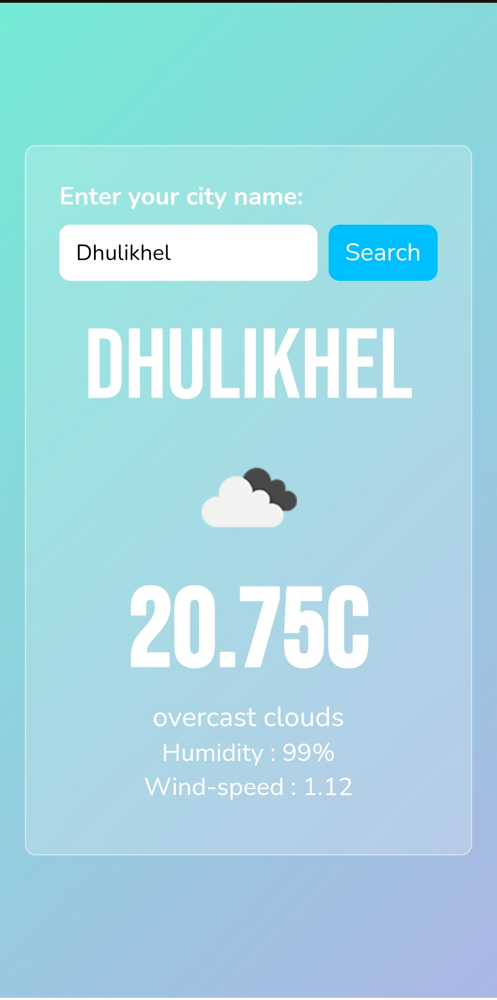

# Weather App 🌤️

Search any city and get real-time weather conditions instantly.

## Live Demo
🔗 [aashutosh-kc.github.io/weather-app](https://aashutosh-kc.github.io/weather-app/)

---

## Preview

---

## Features

- 🌡️ Temperature display
- 💧 Humidity & 🌬️ wind speed
- 🌥️ Weather condition icons
- 🔍 Works for any city worldwide

---

## Built With

<table>
  <tr>
    <td align="center" width="80">
      
       HTML5
    </td>
    <td align="center" width="80">
      
       CSS3
    </td>
    <td align="center" width="80">
      
       JavaScript
    </td>
  </tr>
</table>

**API:** OpenWeatherMap

---

*Built as part of my frontend development journey.*
